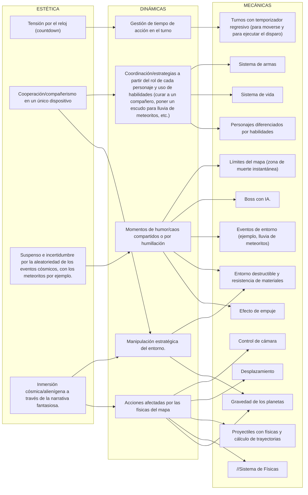
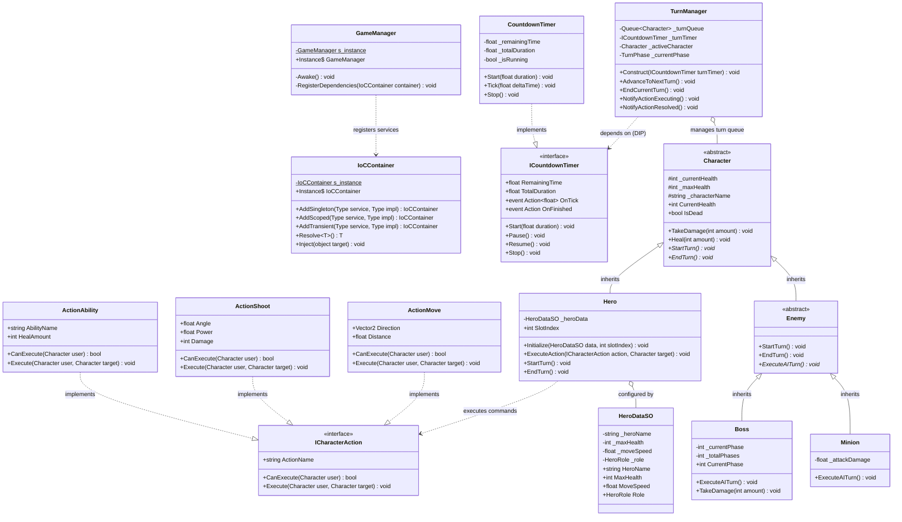

# 🌌 CosmosCritters

> **Proyecto Integrador** — Programación de Videojuegos II
> **Universidad Nacional de Hurlingham (UNAHUR)** — 2do Cuatrimestre 2026 (Comisión 1)
> **Profesor:** Reynaga, Ignacio Daniel

---

## 👥 Integrantes del Equipo

* **Bruque López, Damián**
* **Estrada, Iván**
* **Finoquetto, Adriana Victoria**

---

## 🎮 Game Design Document (GDD)

### Nombre del videojuego

Cosmos Critters ([link al repo](https://github.com/adrianavicfin/tp-videojuegos2))

### Pila tecnológica a utilizar

* **Motor de videojuegos:** Unity LTS `2022.3.62f3`
* **Pipeline Gráfico:** Universal Render Pipeline 2D (**URP 2D**)
* **Lenguaje de programación:** C# (.NET Standard)
* **Justificación:** Elegimos trabajar con este motor ya que será utilizado por el docente para enseñar el contenido de la materia, lo que nos permitirá realizar un mejor seguimiento con respecto a nuestro trabajo.

---

### Descripción general

Videojuego táctico en 2d por turnos, diseñado para 2 a 4 jugadores en modalidad local (HotSeat). Inspirado en worms, cada jugador toma el control de un personaje en un escenario con desniveles y plataformas, cooperando para eliminar a un jefe mediante el cálculo de trayectorias de proyectiles, uso estratégico de armas/roles y aprovechamiento del entorno antes de que el jefe o los eventos del espacio los eliminen.

En Cosmos Critters, los jugadores toman el control de una escuadra alienígena asimétrica con estadísticas y habilidades únicas en un entorno cósmico dinámico. Deben coordinar sus disparos aprovechando la gravedad de múltiples planetoides, la destrucción de coberturas según su resistencia y sobrevivir a eventos cósmicos periódicos (como lluvias de meteoritos) para derrotar a la IA enemiga.

---

### Gameplay

Los jugadores estarían en modo cooperativo, tomando acciones por turno en un tiempo limitado de forma secuencial, contra un enemigo en común. Con posibilidad de acciones de movimiento, ataques de proyectiles o acciones únicas de cada personaje.

La interacción de cada escenario sería similar entre sí, con efectos que alteren las acciones de movimiento o proyectiles, según cómo afecte la física en el momento, modificando la física de los personajes y el resultado de sus acciones según los elementos en pantalla.

Ocurrirán eventos que alteren el escenario en el espacio donde se puede mover y con efectos que podrían modificar las físicas de su cercanía o del escenario completo.

---

### Estilo visual

El estilo visual sería un diseño visual sci-fi 2d, el juego se desarrolla en el espacio con un estilo artístico cartoon animado, un estilo caricaturesco.
La perspectiva del juego se basaría en una cámara centrada en el personaje que tiene el turno en el momento, o en el jefe. Con un formato side-scroll. Con la interfaz alternando entre un personaje y otro para mostrar las acciones posibles.

Ambientado en zonas del espacio, alternando entre escenarios de cuerpos celestiales como meteoritos, planetas o agujeros negros, hasta escenarios internos de naves o estructuras artificiales.

#### Inspiraciones (jugabilidad y diseño visual)

* Worms
* Angry Birds
* Alien hominid
* Spore
* Risk of rain 2
* Astroneer

---

### Posibles ideas a implementar según el desarrollo

* Progresión de niveles
* Valor de resistencia según el objeto del mapa a romper

---

### Matriz MDA

#### Estética:

* Tensión por el reloj (countdown)
* Cooperación/compañerismo en un único dispositivo
* Suspenso e incertidumbre por la aleatoriedad de los eventos cósmicos, con los meteoritos por ejemplo.
* Inmersión cósmica/alienígena a través de la narrativa fantasiosa.

#### Dinámicas:

* Acciones afectadas por las físicas del mapa
* Manipulación estratégica del entorno.
* Coordinación/estrategias a partir del rol de cada personaje y uso de habilidades (curar a un compañero, poner un escudo para lluvia de meteoritos, etc.)
* Gestión de tiempo de acción en el turno
* Momentos de humor/caos compartidos o por humillación

#### Mecánicas:

* Turnos con temporizador regresivo (para moverse y para ejecutar el disparo)
* Gravedad de los planetas
* Efecto de empuje
* //Sistema de Físicas
* Personajes diferenciados por habilidades
* Entorno destructible y resistencia de materiales
* Eventos de entorno (ejemplo, lluvia de meteoritos)
* Boss con IA.
* Sistema de vida
* Sistema de armas
* Proyectiles con físicas y cálculo de trayectorias
* Desplazamiento
* Control de cámara
* Límites del mapa (zona de muerte instantánea)

---

### Gráfico de Relaciones de la Matriz MDA



---

## 🏛️ Diagramas UML

### 📊 Diagrama UML Inicial (GDD)


---

### 📊 Diagrama UML de Implementación (Hito 1)



---

## 📁 Estructura del Código

```
Assets/src/
├── Core/                  # GameManager (Singleton), IoCContainer (Inversión de Control)
├── Data/                  # ScriptableObjects (HeroDataSO), Enums (HeroRole, TurnPhase)
├── Application/           # TurnManager, Timers, Comandos de Acción (Move, Shoot, Ability)
└── Presentation/          # Entidades en escena (Character, Hero, Enemy, Boss, Minion) y UI
```

---

## 🚀 Requisitos e Instalación

1. Clonar el repositorio:
   ```bash
   git clone https://github.com/adrianavicfin/tp-videojuegos2.git
   ```
2. Abrir **Unity Hub** y añadir el proyecto seleccionando la carpeta `CosmosCritters/`.
3. Abrir con la versión oficial de la materia: **Unity 2022.3.62f3**.
